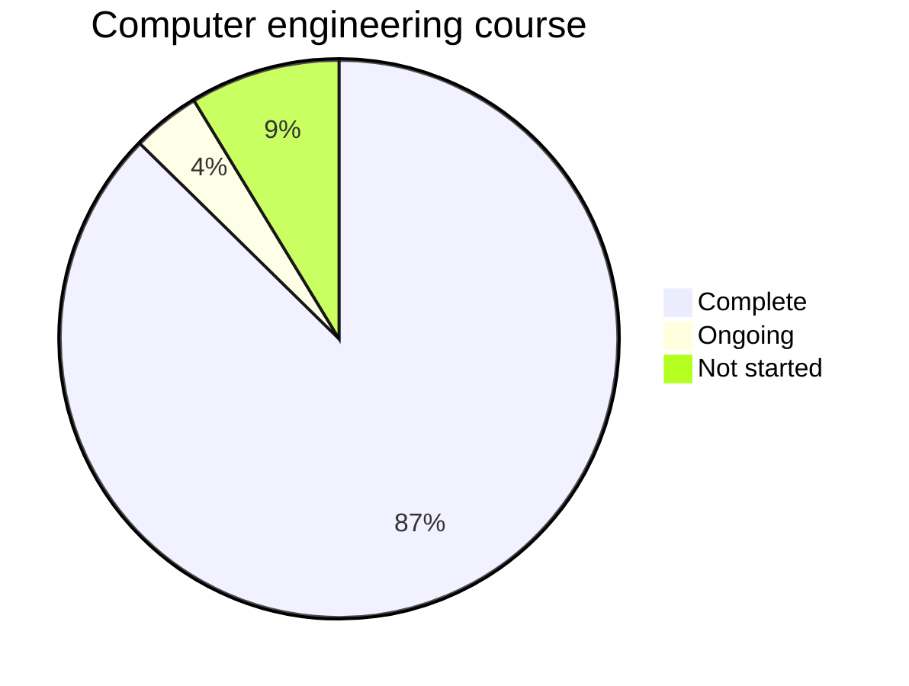

# Homero Kemmerich 

## Overview

Welcome to my personal profile. Here on Github I host my personal projects, as well, as programming notes I take on my college course - Computer Engineering, btw.
Unfortunately, the career projects I worked on are not publicly accessible, But you can have an idea of it accessing it on Google Play Store or App Store.

## Carreer

I work with software development since 2018, through an internship at Stara Inc., a precision agriculture company in Brazil. During my internship I worked with mobile development using Xamarin Forms and Firebase. After that, I was officially hired as a full stack (front-end, back-end, API) developer for the company's telemetry ecosystem projects, also managing various cloud infrastructure tools for the project's support. Most recently I was working in a mobile application for machine control and monitoring at the same company. External to the company I helped on database migration for another company in the real estate field, developing migration scripts between different database models.

During my carreer I had the opporunity to work with various project management framweorks and practices, most importantly kanban and SCRUM, which led to certifications in the fields of software testing and requirements engineering. Most recently on the field, I was ahead on a large multisector project which invisioned the documentation and the creation of company patterns on the APIs developed internally.

### Competences

#### Non-technical

- Leadership
- Project management
- Complex problem solving

#### Technical

- Full-stack development
- Mobile development
- Infrastructure management

## Languages

- English (advanced)
- Spanish (basic)
- Portuguese (native language)

## Academic education

